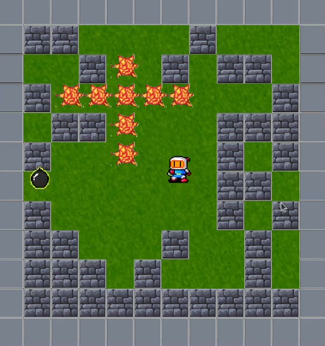

# Bomberman

## Equipe
- Gabriel Grahl Musskopf

---

## Descrição do Projeto

Um jogo Bomberman, onde um jogador caminha pelo mapa, destruindo as barreiras com uma bomba e recolhendo itens que alteram suas características. Este programa foi desenvolvido como parte da disciplina Processamento Gráfico com o objetivo de aplicar conceitos de OpenGL moderna e C++ na criação de uma aplicação interativa. O projeto explora a utilização de shaders, transformações, projeções e detecção de colisões em um ambiente gráfico 2D/3D.

---

## Estrutura do Projeto

Listar e escrever brevemente sobre os principais **arquivos de código** (classes, cabeçalhos e shaders). Por exemplo:

| Arquivo                  | Descrição                                                                 |
|--------------------------|---------------------------------------------------------------------------|
| `Bomberman.cpp`          | Ponto de entrada do programa; inicialização do contexto OpenGL e loop com regras do jogo. |
| `Sprite.h / Sprite.cpp  `| Classe base dos outros objetos com métodos para atualização e desenho        |
| `Player.h / Player.cpp`  | Classe do objeto principal controlado pelo usuário.                          |
| `Bomb.h / Bomb.cpp`      | Classe do objeto de bomba.                                                   |
| `DropBomb.h / DropBomb.cpp`      | Classe do objeto de drop de bomba adicional.                         |
| `Explosion.h / Explosion.cpp`    | Classe do objeto de explosão.                                        |
| `DestructableBarrier.h / DestructableBarrier.cpp`     | Classe do objeto de barreira indestrutível.     |
| `IndestructableBarrier.h / IndestructableBarrier.cpp` | Classe do objeto de barreira destrutível.       |

---

## Informações Técnicas

- **Linguagem:** C++ (C++11 ou superior)  
- **API Gráfica:** OpenGL 3.3+ (core profile)  
- **Dependências:** GLFW, GLAD, stb_image, glm
- **IDE/Compilador:** CMake
- **Plataforma-alvo:** Linux

---

## Checklist de Requisitos

- [x] Criação de janela e contexto OpenGL  
- [x] Configuração de shaders e pipeline programável  
- [X] Implementação de transformações (model, view, projection)  
- [x] Controle de movimentação do personagem/câmera  
- [X] Renderização de múltiplos objetos  
- [x] Detecção de colisão 
  
---

## Screenshots

📷 Screenshots:  

