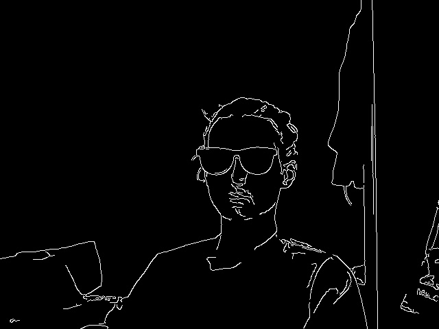
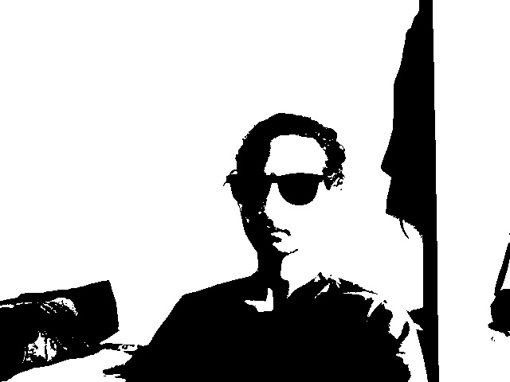
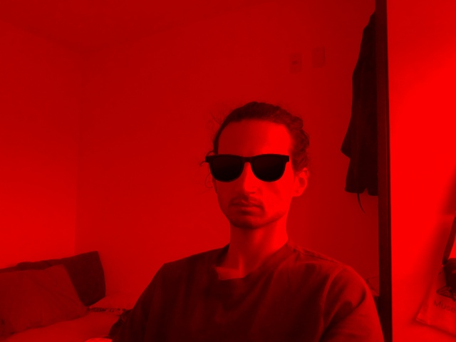
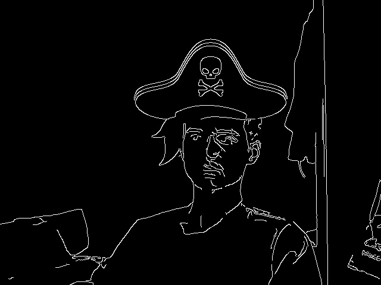
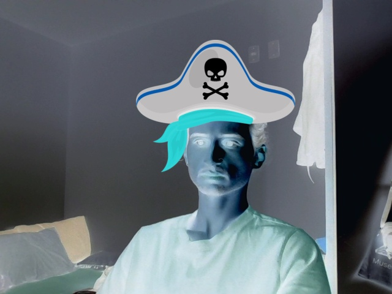

# Edição de imagens

## Equipe
- Gabriel Grahl Musskopf

---

## Descrição do Projeto

Aplicativo simples para aplicar efeitos em imagens. Adicionar filtros, efeitos e stickers em imagens estáticas (modo foto) e vídeo em tempo real (modo vídeo).

### Operações

| Nome                                | Descrição                                                                                                                        | Tipo       |
|-------------------------------------|------------------------------------------------------------------------------------------------------------------------------------|------------|
| Suavização Gaussiana (Blur)         | Reduz ruídos na imagem e suaviza transições. Requer a configuração do tamanho do kernel (ímpar).                                 | Filter     |
| Realce (Sharpen)                    | Aplica um kernel de convolução para aumentar a nitidez das bordas e detalhes da imagem.                                          | Filter     |
| Detecção de Bordas (Canny)          | Aplica o algoritmo Canny para identificar bordas fortes e fracas. Permite configurar dois thresholds.                             | Filter     |
| Inversão de Cores                   | Inverte os valores de pixel (255 - valor), produzindo um negativo da imagem.                                                     | Filter     |
| Binarização (Threshold Simples)     | Converte a imagem para preto e branco usando um valor de limiar. Converte para grayscale antes.                                   | Filter     |
| Erosão Morfológica                  | Filtro morfológico que desgasta as bordas dos objetos, diminuindo-os.                                                             | Filter     |
| Dilatação Morfológica               | Filtro morfológico que engrossa bordas de objetos em primeiro plano.                                                              | Filter     |
| Ajuste de Brilho                    | Aumenta ou diminui o brilho usando adição (gamma). Valor recomendado entre -100 e 100.                                           | Filter     |
| Adição de Imagens (A + B)           | Soma os valores de pixel das imagens A e B. Necessita imagens do mesmo tamanho.                                                   | Operation  |
| Subtração de Imagens (A - B)        | Subtrai os valores de pixel da imagem B da imagem A. Útil para detectar diferenças.                                               | Operation  |
| Blending (Mistura Ponderada)        | Mistura imagens A e B usando pesos (Alpha e Beta). Permite ajustar transparência da mistura.                                      | Operation  |
| Exibir Canal Vermelho (R)           | Exibe a intensidade do canal vermelho (R). É uma visualização, não um filtro.                                                    | Channel    |

---

## Estrutura do Projeto

Listar e escrever brevemente sobre os principais **arquivos de código** (classes, cabeçalhos e shaders). Por exemplo:

| Arquivo                  | Descrição                                                                 |
|--------------------------|---------------------------------------------------------------------------|
| `main.py`          | Gerencia o loop principal do Modo Foto e Modo Vídeo. Lida com a interação do usuário (teclado/console), coordena a leitura dos frames e aplica os filtros/stickers |
| `data_handler.py`| Responsável por carregar imagens estáticas (Modo Foto) e gerenciar a captura de vídeo em tempo real (Modo Vídeo) |
| `image_processor.py`  | Contém as funções de filtros, seleção de canais, e operações matemáticas |
| `sticker_manager.py`      | Gerencia a utilização de stickers, como as informações indivíduais do sticker, posição e tamanho |
| `face_detector.py`      | Carrega o classificador de faces (Haar Cascade) e fornece uma função para detectar as coordenadas do rosto |
| `filter_config.py`    | Contém informações sobre os filtros e operações, como nome, descrição, e a função a ser aplicada |

---

## Checklist de Requisitos

- [x] Pelo menos 10 filtros e operações
- [X] Filtro de suavização (suavização gaussiana)
- [x] Filtro de realce (sharpen)
- [x] Seleção de canais (vermelho)
- [X] Pelo menos 3 operações matemáticas (adição, subtração e blend)
- [x] Descrição dos filtros ao aplicar
- [x] Pelo menos 5 stickers
- [x] Posicionar o sticker com o clique do mouse (modo foto)
- [x] Permitir carregar uma foto ou abrir a webcam
- [x] Salvar a foto/frame
- [x] Resetar a visualização

## Extras

- [x] Detecção de face e posicionamento dos stickers
  
---

## Screenshots

📷 Screenshots:  

